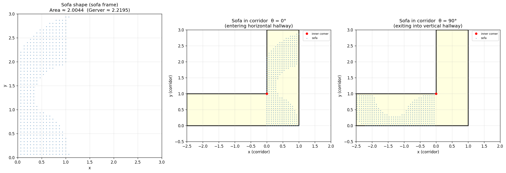

# Gerver's Sofa — Brute-Force Python Solution

A pure-Python implementation that approximates the solution to the
**Moving Sofa Problem** by brute-force grid search.

## Problem Statement

What is the largest area of a 2-D rigid shape that can be moved around a
right-angle corner in a hallway of unit width?

Gerver (1992) found a sofa with area **≈ 2.2195** that is conjectured to
be optimal.

## Approach

1. **Grid representation** – the sofa shape is described by a discrete set
   of `(x, y)` coordinate points satisfying `0 < x < max_width` and
   `0 < y < max_width`.

2. **Corridor model** – the L-shaped corridor of unit width `W = 1` is
   defined as  
   `{(p, q) : 0 ≤ q ≤ W}  ∪  {(p, q) : 0 ≤ p ≤ W, q ≥ 0}`

3. **Rotation & translation check** – for each rotation angle θ ∈ [0, π/2],
   the sofa (all its points simultaneously) is rotated by θ and tested to
   see whether a valid translation `(tx, ty)` exists that keeps every point
   inside the corridor.

4. **Rotating-hallway intersection** – starting from *all* interior grid
   points, the algorithm iteratively removes points that prevent the current
   set from fitting in the corridor at some angle, using a sliding-window
   scan over translated positions. Iteration continues until convergence.

5. **Area** – the surviving grid points give the approximate maximum sofa
   shape; its area is `(number of points) × (grid cell area)`.

## Usage

```bash
pip install numpy matplotlib
python sofa.py --help
```

```
usage: sofa.py [-h] [--max-width MAX_WIDTH] [--resolution RESOLUTION]
               [--num-angles NUM_ANGLES] [--no-plot] [--save SAVE]

options:
  --max-width    Upper bound for x and y sofa-frame coordinates (default: 3.0)
  --resolution   Grid points per unit length — higher = finer (default: 30)
  --num-angles   Rotation angles sampled in [0, π/2] (default: 90)
  --no-plot      Skip the matplotlib visualisation
  --save FILE    Output figure path (default: sofa_result.png)
```

### Quick run (fast, coarse)

```bash
python sofa.py --max-width 3.0 --resolution 15 --num-angles 90
```

```
Sofa grid points : 451
Computed area    : 2.004444
Gerver's limit   : ~2.2195
Ratio            : 0.9031
Can pass corner  : True
```

### Finer approximation (slower)

```bash
python sofa.py --max-width 3.0 --resolution 20 --num-angles 180
```

## Output

The tool produces a three-panel figure:

| Panel | Description |
|-------|-------------|
| Left  | Sofa shape in the sofa's own reference frame |
| Centre | Sofa placed in the corridor at θ = 0° (horizontal hallway) |
| Right | Sofa placed in the corridor at θ = 90° (vertical hallway) |



## Tests

```bash
pip install pytest
python -m pytest test_sofa.py -v
```

22 tests covering corridor geometry, feasibility checks, coverage mask,
and integration tests for the rotating-hallway method.

## Files

| File | Purpose |
|------|---------|
| `sofa.py` | Main implementation |
| `test_sofa.py` | Unit tests |
| `sofa_result.png` | Example output figure |
